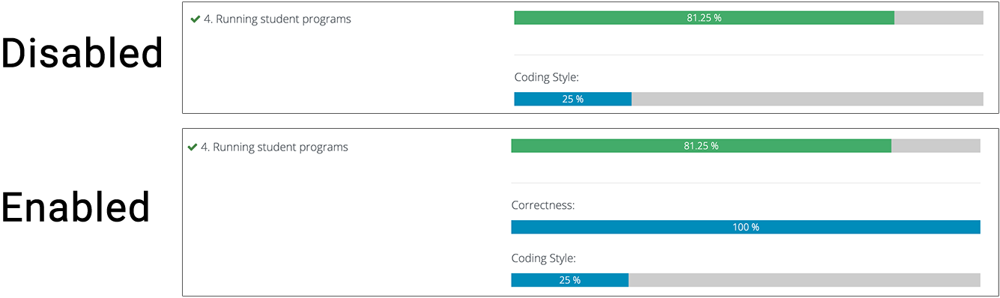

# Configuration

INGInious Coding Style is highly configurable and provides granular control of the majority of its features. Despite this, extensive configuration is not necessary, as the plugin tries to implement sensible defaults, and therefore should just work straight out of the box.

## Minimal Configuration

The following YAML snippet provides the default plugin configuration, and is a good starting point for exploring the plugin's functionality:

```YAML
plugins:
-   plugin_module: inginious_coding_style
    name: "INGInious Coding Style"
```

The minimal configuration enables all default categories:

[`{{ category.id }}`](#{{ category.id }}).

See [Default Categories](#default-categories) for more information about the default categories.

## Full Configuration

Below is an example of a configuration making use of all available configuration options.

```YAML
plugins:
-   plugin_module: inginious_coding_style
    name: "INGInious Coding Style"
    enabled:
        # This enables all default categories + 1 custom category
        - comments
        - modularity
        - structure
        - idiomaticity
        - coolness # Our custom category
    categories:
        # This is a definition for a new category
      - id: coolness
        name: Coolness
        description: How cool the code looks B-)
      # This redefines a default category
      - id: comments
        name: Kommentering
        description: Hvor godt kommentert koden er.
    submission_query:
        header: CSG
        button: true
        priority: 3000
    weighted_mean:
        enabled: true
        weighting: 0.25
```
<!-- TODO: https://squidfunk.github.io/mkdocs-material/reference/data-tables/#configuration -->

<!-- ##### Schema: -->

```YAML

  
   {#- HACK: Add quotes to strings in default value -#}
    {{ k }}: 
      '{{ v }}'
    
      {{ v }}
    
  

required:  {{ id in required }}  {{ False }} 

```


## Parameters

### `name`

Display name of the plugin

{{ get_schema(schema.properties.name, "name") }}

---

### `enabled`

Which coding style categories to enable. Omitting this parameter enables all default categories (
  
    `{{ category.id }}`
  ).

{{ get_schema(schema.properties.enabled, "enabled") }}

---

### `categories`

Define new grading categories or modify default grading categories.

Each category has the following parameters:


#### `id`

Unique ID of the category.


{{ get_schema(schema.definitions.GradingCategory.properties.id, "id", required) }}

#### `name`

Display name of category. Defaults to `id.title()` if omitted.

{{ get_schema(schema.definitions.GradingCategory.properties.id, "name", required) }}

#### `description`

Description of category. This should describe the criteria used for grading.

{{ get_schema(schema.definitions.GradingCategory.properties.id, "description", required) }}

---

### `submission_query`

Settings for the submissions query results table (`/admin/<courseid>/submissions`).

#### `header`

The header text for the plugin's column in the query results table.

{{ get_schema(schema.definitions.SubmissionQuerySettings.properties.header) }}

#### `button`

Adds an additional button to each search result that links to the submission's coding style grading page.

{{ get_schema(schema.definitions.SubmissionQuerySettings.properties.button) }}

#### `priority`

The priority of the plugin hook. The priority must be a number that is unique to the plugin in order to avoid column ordering issues. In cases where the plugin's header does not match its corresponding column in the table body, try to change `priority` to a different number. Given the low number of INGInious plugins in existence, this should virtually never happen, though.

{{ get_schema(schema.definitions.SubmissionQuerySettings.properties.priority) }}

---

### `weighted_mean`

Calculates a new grade for submissions after they have received coding style grades by finding the mean of automated INGInious grade and coding style grades:

`new_grade = (automated_grade * (1 - weighting)) + (coding_style_grade_mean * weighting)`

**Example**

```pycon
>>> automated_grade = 100
>>> mean_style_grade = 80
>>> weighting = 0.25
>>> new_grade = (automated_grade * (1-weighting)) + (mean_style_grade * weighting)
>>> new_grade
95.0
```

#### `enabled`

Enable weighted mean grade calculation.

{{ get_schema(schema.definitions.WeightedMeanSettings.properties.enabled) }}


#### `weighting`

Weighting of coding style grades.

{{ get_schema(schema.definitions.WeightedMeanSettings.properties.weighting) }}

#### `task_list_bar`

Show separate progress bars for correctness and coding style grades in addition to the final weighted mean.



{{ get_schema(schema.definitions.WeightedMeanSettings.properties.task_list_bar) }}
---

<!-- Only display this section if we have generated data/categories.-->


## Default Categories

INGInious Coding Style comes with {{ categories | length }} default grading categories. If you want to change the names or descriptions of these categories, you can override them in your INGInious configuration file.

!!! attention
    The `id` parameter of a category must match the default category's ID if you wish to overwrite a default category. If you simply wish to disable a default category, omit its ID from the top-level `enabled` parameter.

The following is a YAML snippet that includes the definitions for all default categories, which can be added to the plugin configuration should you wish to expand on the existing decriptions or otherwise modify the categories:

```YAML
--8<-- "data/categories.yml"
```


