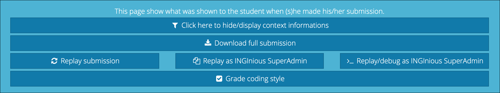

# INGInious Coding Style

INGInious Coding Style is a plugin for INGInious that allows tutors to grade several aspect of student submissions' coding style.

INGInious Coding Style should be easy to use for both tutors and students. The plugin adds new buttons and elements to various existing menus in the application that can be used to add and view coding style grades.

## Plugin Additions

The plugin makes changes to various existing elements in INGInious, as well as adding some new pages.

!!! note
    All design is subject to change. As such, some screenshots might show outdated page designs.

### Grade Overview

Students can view their coding style grades for each task on a course's task list.

### Detailed Feedback For a Single Submission

Students can read detailed feedback by clicking on the new "Coding Style Grades" button found on the task page.

### Submission Grading Button

A new button is added to a submission's admin menu, so that tutors and admins can access the coding style grading interface for a submission.

Pressing the button leads to the grading interface for the submission.

