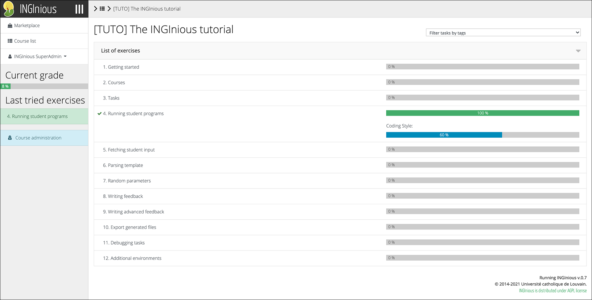
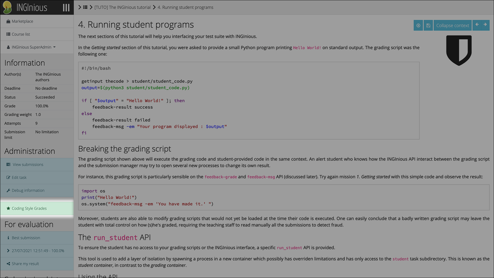
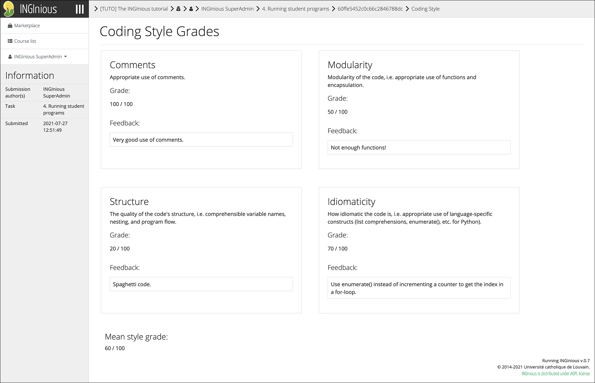

# Student Guide

## Grade Overview

To get an overview of coding style grades for a course, access the course's task list. Coding Style grades are displayed as a separate bar beneath the regular automated grade provided by the INGInious grader.

## View Detailed Feedback

To view detailed feedback for a specific submission, click on the new "Coding Style Grades" button in the sidebar for the task.

!!! note
    The button is only visible if the submission's coding style has been graded.

Detailed feedback is displayed similar to the admin grading interface.
