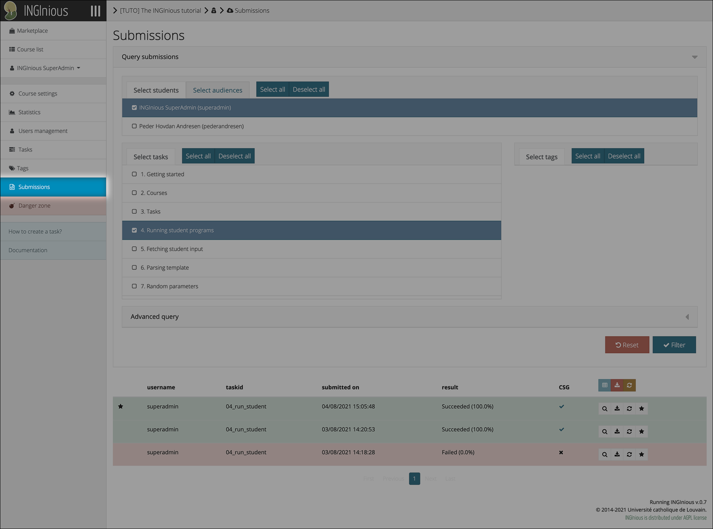
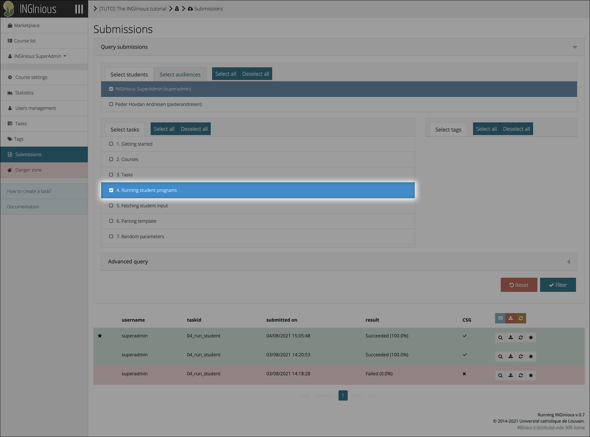
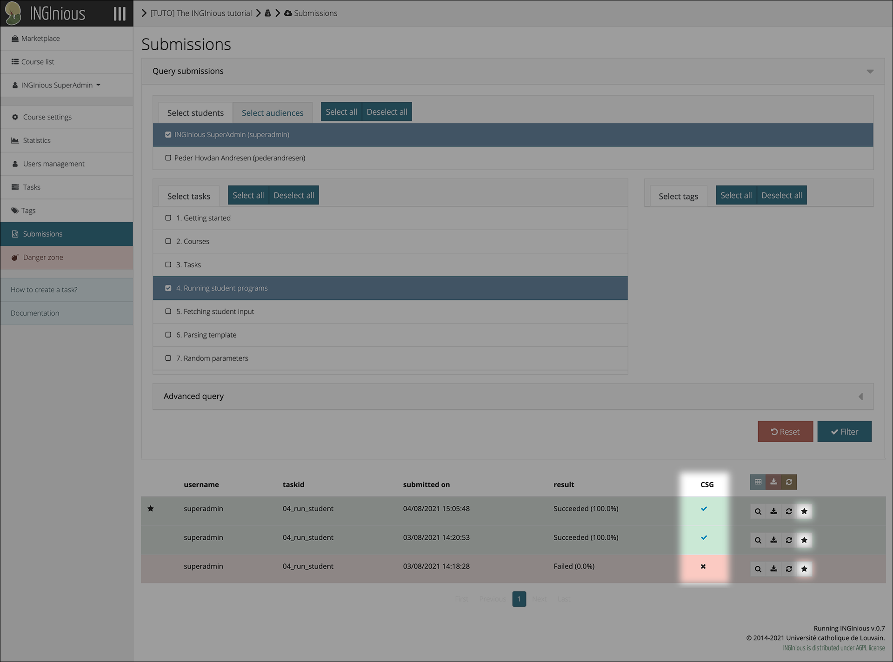
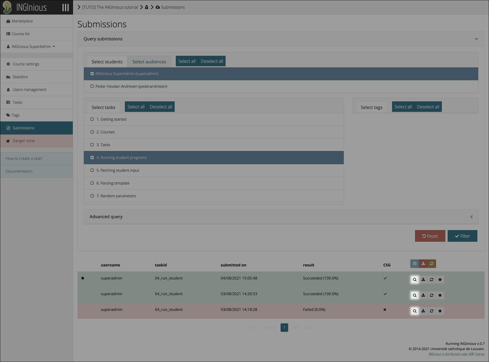
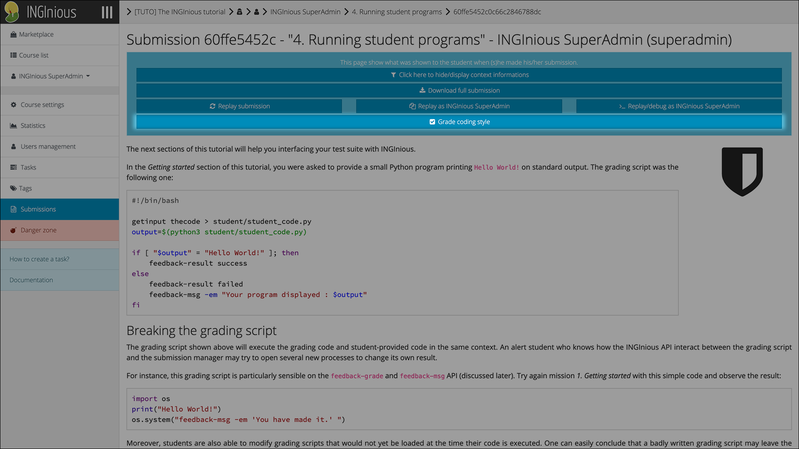
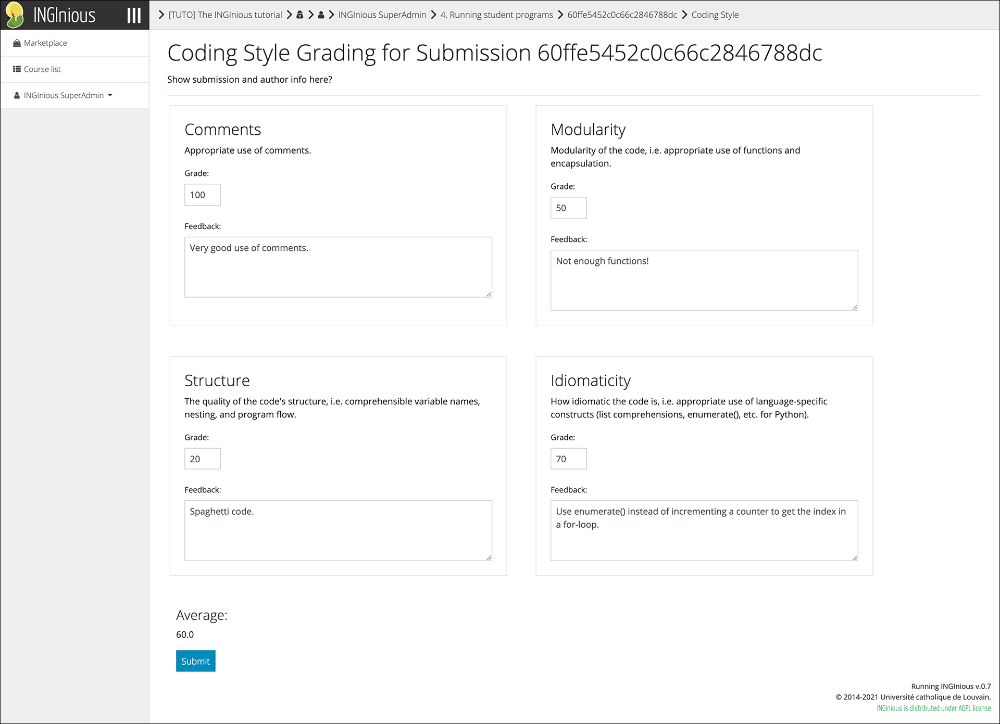
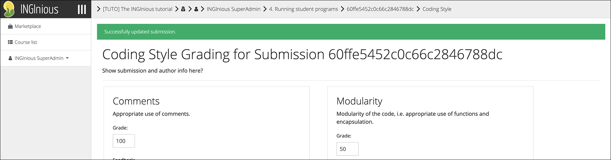

# Tutor Guide

This section demonstrates how a tutor can access the grading interface for a specific assignment.

## Grade a Submission

Click on the "Submissions" button to access the submission query page.

Select the task you want to query submissions for.

In the search result table, the plugin shows a new column (titled "CSG" by default) that contains status icons denoting whether or not submissions have been given coding style grades.

Click on either the status icon or the new button ([if enabled](../../configuration/#button)) to directly access the coding style grading interface.

If you wish to view the submission before grading it (which is advisable), click on the magnifying glass icon.

When viewing a student submission, click on the new "Grade coding style" button to access the grading interface for the submission.

In the coding style grading interface, you can determine grades for each grading category and (optionally) give feedback. After you have finished grading the submission, click on the "Submit" button.

A message is displayed at the top of the page denoting the status of the operation.

