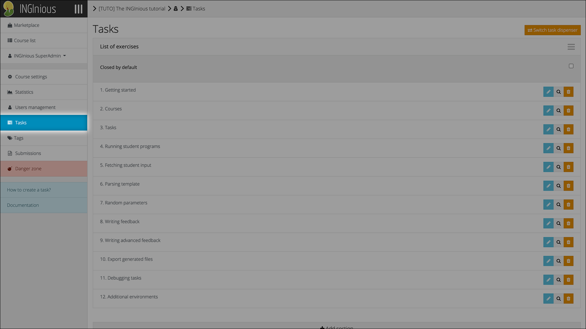
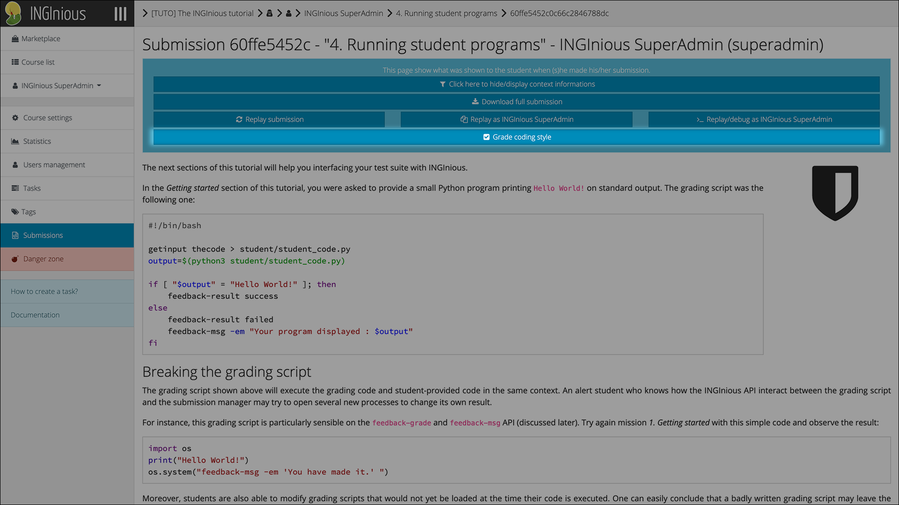

# Tutor Guide

This section demonstrates how a tutor can access the grading interface for a specific assignment.

## Grade a Submission

Click on the "Tasks" button to find the submission you want to grade.

Click on the new "Grade Coding Style" button to access the grading interface for the selected submission.

Add grades and (optionally) feedback to the submission, then click "Submit".

A message is displayed at the top of the page denoting the status of the operation.

